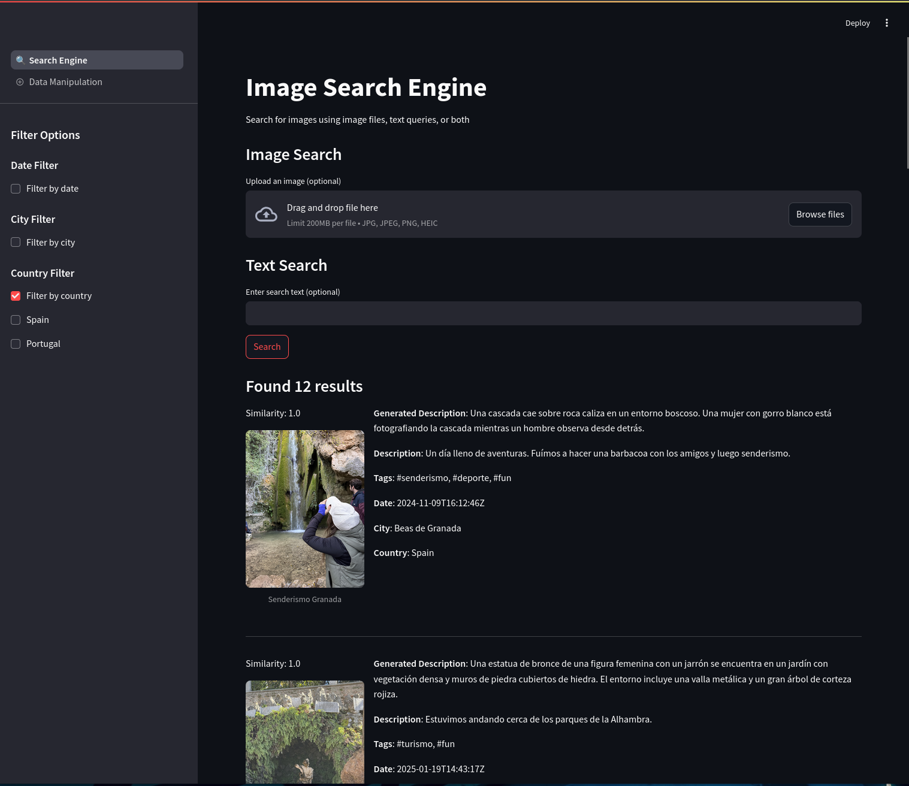

# NostalgIA
Welcome to NostalgIA, a personal photo-diary application supercharged with an Information Retrieval System to help you find and remember your memories better.

This project combines the simplicity of writing daily entries with the power of Elasticsearch for fast, intelligent hybrid search, and a Streamlit web app for a beautiful, interactive interface.



## 🚀 Quick Start: Run with Docker Compose

We use **Docker Compose** to spin up two services:

- **Elasticsearch** (for indexing and searching diary entries)
- **Streamlit** (for the web front-end)

### Prerequisites

- Install [Docker](https://docs.docker.com/get-docker/)
- Install [Docker Compose](https://docs.docker.com/compose/install/)
- (Optional for GPU acceleration) Install [NVIDIA Container Toolkit](https://docs.nvidia.com/datacenter/cloud-native/container-toolkit/install-guide.html)
- Login and include the HuggingFace Token in a `.env` file in the main root directory

> Note: If you want to use GPU-accelerated Models for lower inference time, make sure you have [NVIDIA Docker Setup](https://docs.nvidia.com/datacenter/cloud-native/container-toolkit/install-guide.html) ready.

#### Steps to connect to hugging-face
1. Create an account in hugging-face
2. Set up an access-token with the "Read access to contents of all public gated repos you can access" permission.
3. Search for the model you would like to use and accept it's "Terms of Aggreement" if so (can only use models you agree with).
4. Create a .env with a `HF_TOKEN=<token>`
5. (Optional) Modify the model names in the source code

### 1. Clone the Repository

```bash
git clone https://github.com/briansenas/nostalgIA
cd nostalgIA
```

### 2. Launch the Docker Compose
```bash
docker-compose up --build
```

This will:
1. Start an Elasticsearch service on localhost:9200
2. Start a Streamlit app on localhost:8501

You can now visit the app in your browser at:
👉 http://localhost:8501
## 🛠️ Running Locally with Python

If you prefer running things without Docker:
1. Install Python Requirements

Make sure you have Python 3.8+ installed.
```bash
python -m venv venv
source venv/bin/activate  # On Windows: venv\Scripts\activate
pip install -r requirements.txt
```

2. Start Local Elasticsearch
You must have an Elasticsearch server running locally. You can either:
- Install Elasticsearch manually, or
- Use Docker:
```bash
docker run -p 9200:9200 -e "xpack.security.enabled=false" elasticsearch:9.0.0
```

3. Launch the Streamlit App
```bash
streamlit run app.py
```
The app will be available at http://localhost:8501.

# 📄 Project Structure
```bash
.
├── app
│   ├── app.py
│   └── pages
│       ├── __init__.py
│       ├── search_data.py
│       ├── upload_data.py
│       └── utils
│           ├── elastic.py
│           ├── example-image.jpg
│           ├── http_ca.crt
│           ├── image_exif.py
│           ├── image_models.py
│           ├── index-settings.json
│           ├── __init__.py
│           └── journal.py
├── .env
├── docker-compose.yml
├── Dockerfile
├── LICENSE
├── readme.md
└── requirements.txt
```

# 🧹 Future Improvements
- [ ] Develop bulk insertion page
- [ ] Develop way to edit Entries
- [ ] Develop way to delete Entries
- [ ] Improve UI
    - [ ] Improve facets sidebar. Include facet count.
    - [ ] Use selection boxes in upload page for city/country (avoid user error)
    - [ ] Unify language of the Country / City field.
- [ ] Clean up and refactor code for future-proof
- [ ] Improve search process
